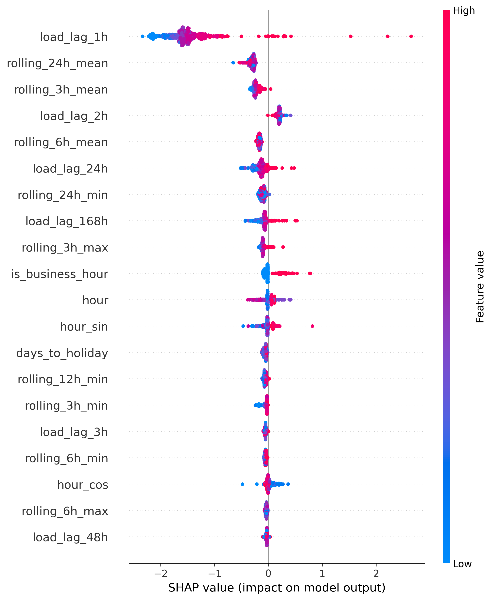
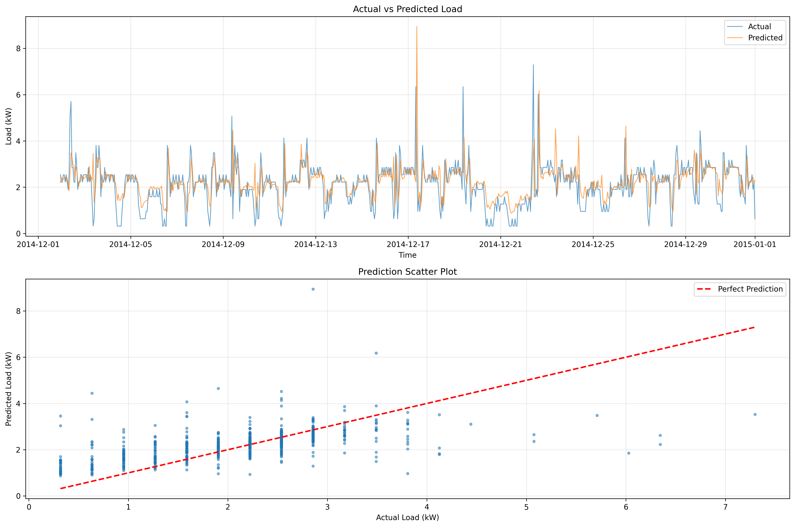

<div align="center">

# ⚡ XAI Load Forecasting

### Explainable Day-Ahead Electrical Load Forecasting

*Transparent predictions you can trust*

[](https://www.python.org/downloads/)
[](LICENSE)
[]()
[]()
[]()

[Features](#-features) • [Quick Start](#-quick-start) • [Results](#-results) • [Docs](#-documentation)

</div>

---

<div align="center">


*Every prediction explained: SHAP analysis reveals what drives your forecasts*
</div>

---

## 🎯 Why This Project?

Grid operators need **accurate** load forecasts, but they also need to **understand** them.

**XAI Load Forecasting** delivers:
- 🔮 **14% better accuracy** than persistence baselines
- 🔍 **Full transparency** via SHAP explanations
- ⚙️ **Production-ready** with FastAPI, Docker, monitoring
- 📊 **Drift detection** for performance alerts

---

## ✨ Features

| Category | Capabilities |
|----------|-------------|
| **Forecasting** | Day-ahead (24h), multi-horizon (1h to 1 week), probabilistic intervals |
| **Explainability** | SHAP, counterfactuals, natural language explanations |
| **Models** | LightGBM/XGBoost, conformal prediction, online learning |
| **MLOps** | MLflow tracking, model registry, A/B testing |
| **Deployment** | FastAPI, Docker, CLI |
| **Monitoring** | Data drift, concept drift, performance alerts |

---

## 📊 Results

| Model | RMSE (kW) | vs Baseline |
|-------|-----------|-------------|
| Persistence | 0.892 | — |
| **LightGBM (Ours)** | **0.770** | **+14%** |

<div align="center">

</div>

📈 [Detailed Results & Analysis →](docs/RESULTS.md)

---

## 🚀 Quick Start

```bash
# Install
git clone https://github.com/Dex947/xai-load-forecasting.git
cd xai-load-forecasting
pip install -r requirements.txt

# Train
python -m src.cli train --config config/config.yaml

# Serve API
python -m src.cli serve --port 8000
```

```python
from src.models.gbm import GradientBoostingModel

model = GradientBoostingModel.load('models/artifacts/lightgbm_model.pkl')
predictions = model.predict(X_new)
```

📖 [Full Usage Guide →](docs/USAGE.md)

---

## 🔌 API

```bash
uvicorn src.api:app --port 8000
```

| Endpoint | Description |
|----------|-------------|
| `GET /health` | Health check |
| `POST /predict` | Single prediction |
| `POST /predict/batch` | Batch predictions |
| `GET /importance` | Feature importance |

```bash
# Docker
docker-compose up -d
```

---

## 🏗️ Architecture

```
xai-load-forecasting/
├── src/
│   ├── models/         # LightGBM, quantile, multi-horizon
│   ├── explainability/ # SHAP analysis
│   ├── monitoring/     # Drift detection
│   ├── api.py          # FastAPI server
│   └── cli.py          # CLI interface
├── config/             # YAML configuration
├── tests/              # 24 pytest tests
└── docs/               # Documentation
```

---

## 📚 Documentation

| Doc | Description |
|-----|-------------|
| [Results](docs/RESULTS.md) | Detailed performance analysis |
| [Usage](docs/USAGE.md) | Full usage guide |
| [Model Card](docs/model_card.md) | Scope, limitations, failure modes |
| [API Docs](http://localhost:8000/docs) | Interactive API docs |
| [CHANGELOG](CHANGELOG.md) | Version history |
| [CONTRIBUTING](CONTRIBUTING.md) | Contribution guide |

---

## 📜 License

MIT License - see [LICENSE](LICENSE)

---

## 🙏 Acknowledgments

- **Data**: [UCI Electricity Load Diagrams](https://archive.ics.uci.edu/ml/datasets/ElectricityLoadDiagrams20112014), [Open-Meteo](https://open-meteo.com/)
- **Libraries**: SHAP, LightGBM, FastAPI, scikit-learn

---

<div align="center">

**Current Version**: 3.0.0

[⬆ Back to top](#-xai-load-forecasting)

</div>
