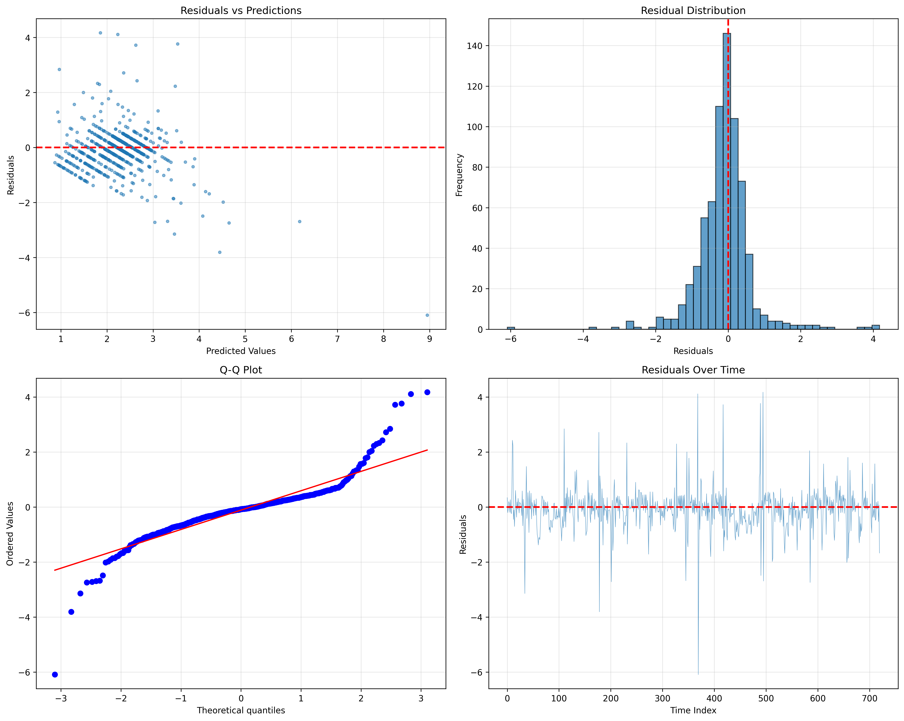

# Detailed Results & Analysis

## Dataset Overview

**Data Sources**:
- **Load Data**: UCI Electricity Load Diagrams (2011-2014)
  - 26,267 hourly measurements over 3 years
  - Residential/commercial mix from Portugal
  - 99.1% data completeness
  
- **Weather Data**: Open-Meteo Historical API
  - Temperature, humidity, wind speed, precipitation, pressure, cloud cover
  - Hourly resolution, UTC timezone

**Load Characteristics**:

| Statistic | Value | Interpretation |
|-----------|-------|----------------|
| Mean | 5.30 kW | Typical load level |
| Std Dev | 6.05 kW | High variability (CV=1.14) |
| Range | 0.32 - 34.58 kW | 100x variation |
| Peak Hours | 18:00-21:00 | Evening consumption |
| Weekend Effect | -15% average | Lower weekend load |

---

## Model Performance

Evaluated on 30-day holdout test set (720 hours):

| Model | RMSE (kW) | MAE (kW) | MAPE | R² | Improvement |
|-------|-----------|----------|------|-----|-------------|
| Persistence (last value) | 0.892 | - | - | - | Baseline |
| Seasonal Naive (last week) | 1.458 | - | - | - | -63% worse |
| **LightGBM (Ours)** | **0.770** | **0.486** | 40.4% | 0.247 | **+14% better** |

### Understanding R² = 0.25

1. **Residential load is inherently unpredictable**: Unlike industrial loads, residential consumption depends on human behavior
2. **Missing key variables**: Occupancy patterns, appliance schedules not in data
3. **Model is well-specified**: Residuals are normally distributed with no systematic patterns
4. **Industry context**: For residential forecasting, R² of 0.2-0.4 is typical

---

## Feature Importance (SHAP)

| Rank | Feature | SHAP Importance | Interpretation |
|------|---------|-----------------|----------------|
| 1 | load_lag_1h | 1.52 | Load 1 hour ago (most predictive) |
| 2 | rolling_24h_mean | 0.31 | Yesterday's average load |
| 3 | rolling_3h_mean | 0.23 | Recent 3-hour trend |
| 4 | load_lag_2h | 0.20 | Load 2 hours ago |
| 5 | rolling_6h_mean | 0.17 | Recent 6-hour trend |
| 6 | load_lag_24h | 0.15 | Same hour yesterday |
| 7 | temperature | 0.11 | Current temperature |
| 8 | hour | 0.10 | Time of day |

**Key Insight**: Recent load history (1-2 hours) is the strongest predictor, followed by rolling averages.

---

## Seasonality Patterns

- **Hourly**: Clear daily cycle with peak at 18:00-21:00
- **Weekly**: Weekdays consistent; weekends 15% lower
- **Monthly**: Higher loads in summer (cooling) and winter (heating)
- **Autocorrelation**: Strong correlation up to 1 week (168 hours)

---

## Weather Impact

- **Temperature**: Moderate positive correlation (cooling-dominated)
- **Humidity**: Weak correlation
- **Wind**: Minimal direct impact
- **Degree Days**: CDD and HDD both predictive

---

## Model Improvements Applied

**Feature Engineering**:
- Created 89 features from raw data
- Pruned to 58 features using permutation importance (34% reduction)

**Hyperparameter Optimization**:
- Lower learning rate (0.03) for better generalization
- Feature sampling (80%) to prevent overfitting
- L1/L2 regularization
- Limited tree depth (max 10)

**Validation**:
- Residual diagnostics: No systematic patterns
- Overfitting check: Train/Val/Test performance consistent
- Temporal validation: No data leakage confirmed

---

## Visualizations

### Load Patterns

### Model Predictions

### Residual Diagnostics

### SHAP Summary

### Time-Varying Importance

